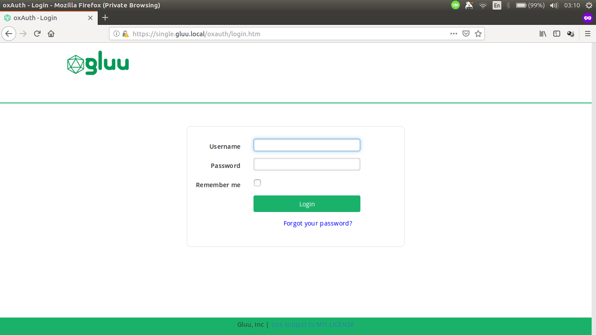

## Overview

Basic knowledge of Gluu Server [custom design](https://gluu.org/docs/ce/4.0/operation/custom-design/) is required.

Similar directories to those found in Gluu Server CE also exist in Gluu Server DE, though there is a difference in how to put these customizations inside the container, compared to Gluu Server CE.

```text
/opt/gluu/jetty/oxauth/
|-- custom
|   |-- i18n
|   |-- libs
|   |-- pages
|   `-- static`
```

## Custom oxAuth Login Page Example

This guide will show examples of how to customize HTML pages and CSS in oxAuth for Gluu Server DE.
For simplicity, we are going to use `docker-compose.yml` from the Singlehost example:

```yaml
services:
  oxauth:
    image: gluufederation/oxauth:4.0.1_05
    volumes:
      - ./volumes/oxauth/custom/pages:/opt/gluu/jetty/oxauth/custom/pages
      - ./volumes/oxauth/custom/static:/opt/gluu/jetty/oxauth/custom/static
      - ./volumes/oxauth/custom/libs:/opt/gluu/jetty/oxauth/custom/libs
      - ./volumes/oxauth/custom/i18n:/opt/gluu/jetty/oxauth/custom/i18n
      - ./volumes/oxauth/logs:/opt/gluu/jetty/oxauth/logs
```

As we can see, there are volumes for custom pages and static resources:

```yaml
volumes:
  - ./volumes/oxauth/custom/pages:/opt/gluu/jetty/oxauth/custom/pages
  - ./volumes/oxauth/custom/static:/opt/gluu/jetty/oxauth/custom/static
```

Here's the screenshot of the default oxAuth login page.



As an example, add text to the top of the form and change the color of the button by following these steps:

1.  Get the `login.xhtml` from oxAuth container:

    ```sh
    docker cp oxauth:/opt/gluu/jetty/oxauth/webapps/oxauth/login.xhtml volumes/oxauth/custom/pages/login.xhtml
    ```

1.  Copy the following text and save it as `volumes/oxauth/custom/static/custom.css`:

    ```css
    #loginForm .btn-primary {
        background: #1a9db2
    }
    ```

1.  Modify `volumes/oxauth/custom/pages/login.xhtml`:

    ```html
    <!-- insert custom CSS -->
    <ui:define name="head">
        <meta name="description" content="Gluu, Inc." />
        <link rel="stylesheet" href="/oxauth/ext/resources/custom.css" type="text/css" />
    </ui:define>

    <!-- add text -->
    <div class="bs-docs-section" style="border-top: 2px solid #1ab26b !important;">
        <div class="container">
            <h2>Enter Credentials</h2>
            <h:panelGroup  rendered="false">
                <div class="login_bx">
    ```

    Save the file and login to oxAuth/oxTrust UI via browser.

Here's the screenshot of customized oxAuth login page.


## Custom Files in Multiple oxAuth Containers

### Using Docker Config (Swarm Mode)

Create a config file to store the content of `login.xhtml` and `custom.css`.

```sh
docker config create oxauth-login-html login.xhtml
docker config create oxauth-custom-css custom.css
```

Then, _mount_ them into the container.

```sh
docker service create \
    --name oxauth \
    --config src=oxauth-login-html,target=/opt/gluu/jetty/oxauth/custom/pages/login.xhtml \
    --config src=oxauth-custom-css,target=/opt/gluu/jetty/oxauth/custom/static/custom.css \
    gluufederation/oxauth:4.0.1_05
```

Another option is to use a YAML file.

```yaml
services:
  oxauth:
    image: gluufederation/oxauth:4.0.1_05
    configs:
      - source: oxauth-login-html
        target: /opt/gluu/jetty/oxauth/custom/pages/login.xhtml
      - source: oxauth-custom-css
        target: /opt/gluu/jetty/oxauth/custom/static/custom.css

configs:
  oxauth-login-html:
    external: true
  oxauth-custom-css:
    external: true
```

### Using Kubernetes ConfigMaps

Create a config file to store the content of `login.xhtml` and `custom.css`.

```sh
kubectl create cm oxauth-custom-html --from-file=login.xhtml
kubectl create cm oxauth-custom-css --from-file=custom.css
```

Attach the config to Pod using YAML file:

```yaml
apiVersion: v1
kind: Pod
metadata:
  name: oxauth
spec:
  containers:
    image: gluufederation/oxauth:4.0.1_05
    volumeMounts:
      - name: oxauth-pages-volume
        mountPath: /opt/gluu/jetty/oxauth/custom/pages # login.xthml will be mounted under this directory
      - name: oxauth-static-volume
        mountPath: /opt/gluu/jetty/oxauth/custom/static # custom.css will be mounted under this directory
    volumes:
      - name: oxauth-pages-volume
        configMap:
          name: oxauth-custom-html
      - name: oxauth-static-volume
        configMap:
          name: oxauth-custom-css
```
