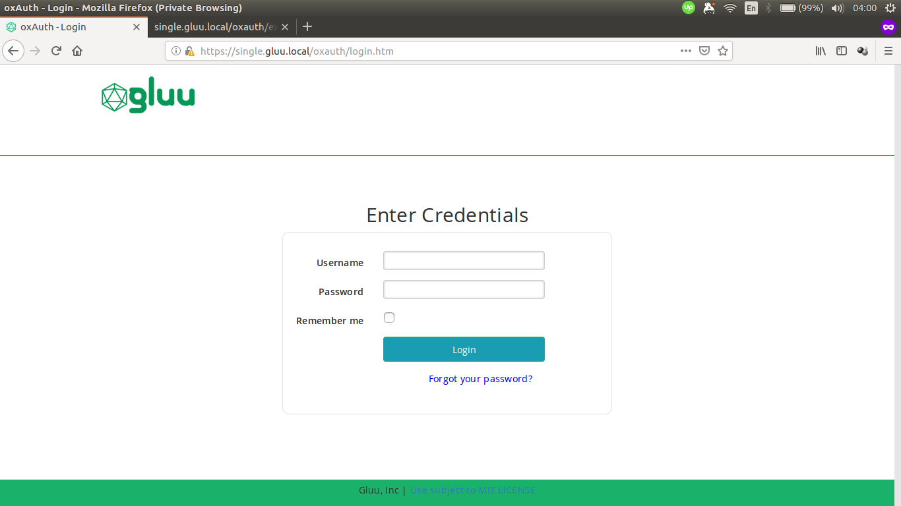

## Overview

The oxAuth version of Gluu Server DE can be customized. Basic knowledge on [custom design](https://gluu.org/docs/ce/3.1.5/operation/custom-design/) is required.

The similar directories as found in Gluu Server CE also exist in Gluu Server DE, though there is difference on how to put these customization inside the container compared to Gluu Server CE.

    /opt/gluu/jetty/oxauth/
    |-- custom
    |   |-- i18n
    |   |-- libs
    |   |-- pages
    |   `-- static`

## Custom oxAuth Login Page Example

This guide will show examples on how to customize HTML page and CSS in oxAuth Gluu Server DE.
For simplicity, we are going to use `docker-compose.yml` from Singlehost example:

    services:
      oxauth:
        image: gluufederation/oxauth:3.1.5_dev
        volumes:
          - ./volumes/oxauth/custom/pages:/opt/gluu/jetty/oxauth/custom/pages
          - ./volumes/oxauth/custom/static:/opt/gluu/jetty/oxauth/custom/static
          - ./volumes/oxauth/custom/libs:/opt/gluu/jetty/oxauth/custom/libs
          - ./volumes/oxauth/custom/i18n:/opt/gluu/jetty/oxauth/custom/i18n
          - ./volumes/oxauth/logs:/opt/gluu/jetty/oxauth/logs

As we can see there are volumes for custom pages and static resources:

    volumes:
      - ./volumes/oxauth/custom/pages:/opt/gluu/jetty/oxauth/custom/pages
      - ./volumes/oxauth/custom/static:/opt/gluu/jetty/oxauth/custom/static

Here's the screenshot of default oxAuth login page.

We are going to add text on top of the form and change the color of the button by running the following steps:

1.  Get the `login.xhtml` from oxAuth container:

        docker cp oxauth:/opt/gluu/jetty/oxauth/webapps/oxauth/login.xhtml volumes/oxauth/custom/pages/login.xhtml

2.  Copy the following text and save it as `volumes/oxauth/custom/static/custom.css`:

        #loginForm .btn-primary {
            background: #1a9db2
        }

3.  Modify `volumes/oxauth/custom/pages/login.xhtml`:

        <!-- insert custom CSS -->
        <ui:define name="head">
            <meta name="description" content="Gluu, Inc." />
            <link rel="stylesheet" href="/oxauth/ext/resources/custom.css" type="text/css" />
        </ui:define>

        <!-- add text -->
        

            

                <h2>Enter Credentials</h2>
                <h:panelGroup  rendered="false">
                    

    Save the file and login to oxAuth/oxTrust UI via browser.

Here's the screenshot of customized oxAuth login page.

## Custom Files in Multiple oxAuth Containers

### Using Docker Config (Swarm Mode)

Create config to store the content of `login.xhtml` and `custom.css`.

    docker config create oxauth-login-html login.xhtml
    docker config create oxauth-custom-css custom.css

Afterwards _mount_ them into container.

    docker service create \
        --name oxauth \
        --config src=oxauth-login-html,target=/opt/gluu/jetty/oxauth/custom/pages/login.xhtml \
        --config src=oxauth-custom-css,target=/opt/gluu/jetty/oxauth/custom/static/custom.css \
        gluufederation/oxauth:3.1.5_dev

Another option is to use YAML file.

    services:
      oxauth:
        image: gluufederation/oxauth:3.1.5_dev
        configs:
          - source: oxauth-login-html
            target: /opt/gluu/jetty/oxauth/custom/pages/login.xhtml
          - source: oxauth-custom-css
            target: /opt/gluu/jetty/oxauth/custom/static/custom.css

    configs:
      oxauth-login-html:
        external: true
      oxauth-custom-css:
        external: true

### Using Kubernetes ConfigMaps

Create config to store the content of `login.xhtml` and `custom.css`.

    kubectl create cm oxauth-custom-html --from-file=login.xhtml
    kubectl create cm oxauth-custom-css --from-file=custom.css

Attach the config to Pod using YAML file:

    apiVersion: v1
    kind: Pod
    metadata:
      name: oxauth
    spec:
      containers:
        image: gluufederation/oxauth:3.1.5_dev
        volumeMounts:
          - name: oxauth-pages-volume
            # login.xthml will be mounted under this directory
            mountPath: /opt/gluu/jetty/oxauth/custom/pages
          - name: oxauth-static-volume
            # custom.css will be mounted under this directory
            mountPath: /opt/gluu/jetty/oxauth/custom/static
      volumes:
        - name: oxauth-pages-volume
          configMap:
            name: oxauth-custom-html
        - name: oxauth-static-volume
          configMap:
            name: oxauth-custom-css
