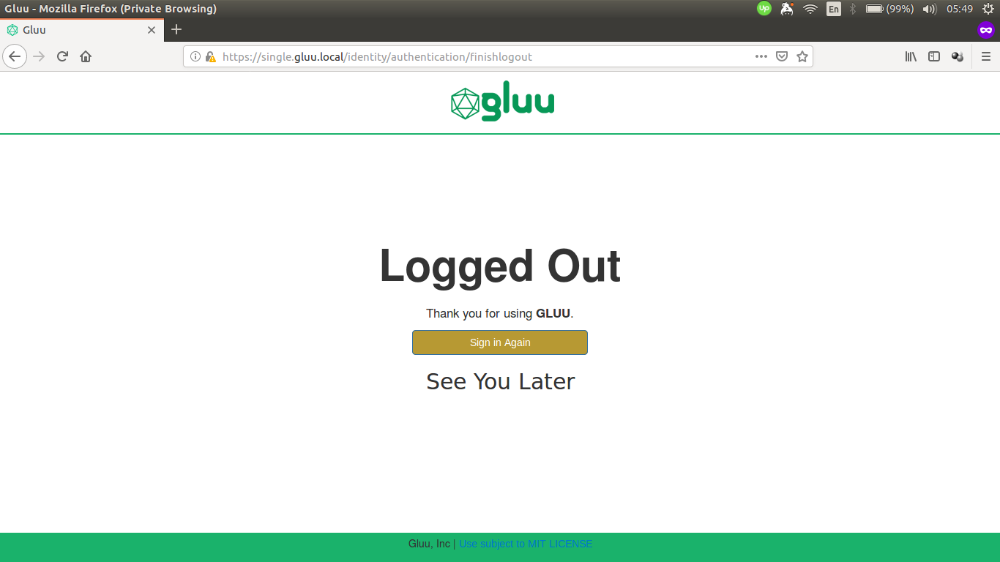

## Overview

Basic knowledge on Gluu Server [custom design](https://gluu.org/docs/ce/4.0/operation/custom-design/) is required.

Similar directories to those found in Gluu Server CE also exist in Gluu Server DE, though there is a difference in how to put these customizations inside the container, compared to Gluu Server CE.

```text
/opt/gluu/jetty/identity/
|-- custom
|   |-- i18n
|   |-- libs
|   |-- pages
|   `-- static`
```

## Custom oxTrust Logout Page Example

This guide will show examples of how to customize HTML pages and CSS in oxTrust for Gluu Server DE. For simplicity, we are going to use docker-compose.yml from the Singlehost example:

```yaml
services:
  oxtrust:
    image: gluufederation/oxtrust:4.0.1_05
    volumes:
      - ./volumes/oxtrust/custom/pages:/opt/gluu/jetty/oxtrust/custom/pages
      - ./volumes/oxtrust/custom/static:/opt/gluu/jetty/oxtrust/custom/static
      - ./volumes/oxtrust/custom/libs:/opt/gluu/jetty/oxtrust/custom/libs
      - ./volumes/oxtrust/custom/i18n:/opt/gluu/jetty/oxtrust/custom/i18n
      - ./volumes/oxtrust/logs:/opt/gluu/jetty/oxtrust/logs
```

As we can see there are volumes for custom pages and static resources:

```yaml
volumes:
  - ./volumes/oxtrust/custom/pages:/opt/gluu/jetty/oxtrust/custom/pages
  - ./volumes/oxtrust/custom/static:/opt/gluu/jetty/oxtrust/custom/static
```

Here's the screenshot of default oxTrust logout page.


As an example, add text to the top of the form and change the color of the button by following these steps:

1.  Get the `finishlogout.xhtml` from oxTrust container:

    ```sh
    docker cp oxtrust:/opt/gluu/jetty/identity/webapps/identity/finishlogout.xhtml volumes/oxtrust/custom/pages/finishlogout.xhtml
    ```

1.  Copy the following text and save it as `volumes/oxtrust/custom/static/custom.css`:

    ```css
    .lockscreen-wrapper .btn-primary {
        background-color: #b79933 !important;
    }
    ```

1.  Modify `volumes/oxtrust/custom/pages/finishlogout.xhtml` (some texts are omitted):

    ```html
    <!-- insert custom CSS -->
    <ui:define name="head">
        <meta name="description" content="Gluu, Inc." />
        <link rel="stylesheet" href="/identity/ext/resources/custom.css" type="text/css" />
    </ui:define>

    <!-- add text -->
    <div class="lockscreen-wrapper" style="text-align: center;">
        <a class="btn btn-block btn-primary btn-lg" href="../login"
                style="width: 60%;">#{msg['finishLogout.signIn']}</a>
        <h2>See You Later</h2>
    </div>
    ```

    Save the file and log in to oxAuth/oxTrust UI via browser.

Here's the screenshot of customized oxTrust logout page.



## Custom Files in Multiple oxTrust Containers

### Using Docker Config (Swarm Mode)

Create a config file to store the content of login.xhtml and custom.css.

```sh
docker config create oxtrust-finishlogout-html finishlogout.xhtml
docker config create oxtrust-custom-css custom.css
```

Then, _mount_ them into the container.

```sh
docker service create \
    --name oxtrust \
    --config src=oxtrust-finishlogout-html,target=/opt/gluu/jetty/oxtrust/custom/pages/finishlogout.xhtml \
    --config src=oxtrust-custom-css,target=/opt/gluu/jetty/oxtrust/custom/static/custom.css \
    gluufederation/oxtrust:4.0.1_05
```

Another option is to use a YAML file.

```yaml
services:
  oxtrust:
    image: gluufederation/oxtrust:4.0.1_05
    configs:
      - source: oxtrust-finishlogout-html
        target: /opt/gluu/jetty/oxtrust/custom/pages/finishlogout.xhtml
      - source: oxtrust-custom-css
        target: /opt/gluu/jetty/oxtrust/custom/static/custom.css

configs:
  oxtrust-finishlogout-html:
    external: true
  oxtrust-custom-css:
    external: true
```

### Using Kubernetes ConfigMaps

Create a config file to store the contents of `finishlogout.xhtml` and `custom.css`.

```sh
kubectl create cm oxtrust-custom-html --from-file=finishlogout.xhtml
kubectl create cm oxtrust-custom-css --from-file=custom.css
```

Attach the config to Pod using YAML file:

```yaml
apiVersion: v1
kind: Pod
metadata:
  name: oxtrust
spec:
  containers:
  image: gluufederation/oxtrust:4.0.1_05
  volumeMounts:
    - name: oxtrust-pages-volume
      mountPath: /opt/gluu/jetty/identity/custom/pages # finishlogout.xthml will be mounted under this directory
    - name: oxtrust-static-volume
      mountPath: /opt/gluu/jetty/identity/custom/static # custom.css will be mounted under this directory
  volumes:
    - name: oxtrust-pages-volume
      configMap:
        name: oxtrust-custom-html
    - name: oxtrust-static-volume
      configMap:
        name: oxtrust-custom-css
```
