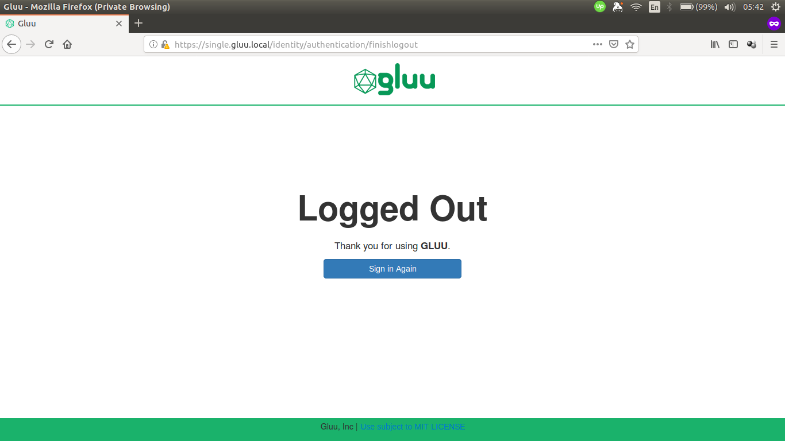

## Overview

The oxTrust version of Gluu Server DE can be customized. Basic knowledge on [custom design](https://gluu.org/docs/ce/3.1.5/operation/custom-design/) is required.

The similar directories as found in Gluu Server CE also exist in Gluu Server DE, though there is difference on how to put these customization inside the container compared to Gluu Server CE.

    /opt/gluu/jetty/identity/
    |-- custom
    |   |-- i18n
    |   |-- libs
    |   |-- pages
    |   `-- static`

## Custom oxTrust Logout Page Example

This guide will show examples on how to customize HTML page and CSS in oxTrust Gluu Server DE.
For simplicity, we are going to use `docker-compose.yml` from Singlehost example:

    services:
      oxtrust:
        image: gluufederation/oxtrust:3.1.5_dev
        volumes:
          - ./volumes/oxtrust/custom/pages:/opt/gluu/jetty/oxtrust/custom/pages
          - ./volumes/oxtrust/custom/static:/opt/gluu/jetty/oxtrust/custom/static
          - ./volumes/oxtrust/custom/libs:/opt/gluu/jetty/oxtrust/custom/libs
          - ./volumes/oxtrust/custom/i18n:/opt/gluu/jetty/oxtrust/custom/i18n
          - ./volumes/oxtrust/logs:/opt/gluu/jetty/oxtrust/logs

As we can see there are volumes for custom pages and static resources:

    volumes:
      - ./volumes/oxtrust/custom/pages:/opt/gluu/jetty/oxtrust/custom/pages
      - ./volumes/oxtrust/custom/static:/opt/gluu/jetty/oxtrust/custom/static

Here's the screenshot of default oxTrust logout page.

We are going to add text below the button and change the color of the button by running the following steps:

1.  Get the `finishlogout.xhtml` from oxTrust container:

        docker cp oxtrust:/opt/gluu/jetty/identity/webapps/identity/finishlogout.xhtml volumes/oxtrust/custom/pages/finishlogout.xhtml

2.  Copy the following text and save it as `volumes/oxtrust/custom/static/custom.css`:

        .lockscreen-wrapper .btn-primary {
            background-color: #b79933 !important;
        }

3.  Modify `volumes/oxtrust/custom/pages/finishlogout.xhtml` (some texts are omitted):

        <!-- insert custom CSS -->
        <ui:define name="head">
            <meta name="description" content="Gluu, Inc." />
            <link rel="stylesheet" href="/identity/ext/resources/custom.css" type="text/css" />
        </ui:define>

        <!-- add text -->
        

            <a class="btn btn-block btn-primary btn-lg" href="../login"
                    style="width: 60%;">#{msg['finishLogout.signIn']}</a>
            <h2>See You Later</h2>
        

    Save the file and login to oxtrust/oxTrust UI via browser.

Here's the screenshot of customized oxTrust logout page.

## Custom Files in Multiple oxTrust Containers

### Using Docker Config (Swarm Mode)

Create config to store the content of `finishlogout.xhtml` and `custom.css`.

    docker config create oxtrust-finishlogout-html finishlogout.xhtml
    docker config create oxtrust-custom-css custom.css

Afterwards _mount_ them into container.

    docker service create \
        --name oxtrust \
        --config src=oxtrust-finishlogout-html,target=/opt/gluu/jetty/oxtrust/custom/pages/finishlogout.xhtml \
        --config src=oxtrust-custom-css,target=/opt/gluu/jetty/oxtrust/custom/static/custom.css \
        gluufederation/oxtrust:3.1.5_dev

Another option is to use YAML file.

    services:
      oxtrust:
        image: gluufederation/oxtrust:3.1.5_dev
        configs:
          - source: oxtrust-finishlogout-html
            target: /opt/gluu/jetty/oxtrust/custom/pages/finishlogout.xhtml
          - source: oxtrust-custom-css
            target: /opt/gluu/jetty/oxtrust/custom/static/custom.css

    configs:
      oxtrust-finishlogout-html:
        external: true
      oxtrust-custom-css:
        external: true

### Using Kubernetes ConfigMaps

Create config to store the content of `finishlogout.xhtml` and `custom.css`.

    kubectl create cm oxtrust-custom-html --from-file=finishlogout.xhtml
    kubectl create cm oxtrust-custom-css --from-file=custom.css

Attach the config to Pod using YAML file:

    apiVersion: v1
    kind: Pod
    metadata:
      name: oxtrust
    spec:
      containers:
        image: gluufederation/oxtrust:3.1.5_dev
        volumeMounts:
          - name: oxtrust-pages-volume
            # finishlogout.xthml will be mounted under this directory
            mountPath: /opt/gluu/jetty/identity/custom/pages
          - name: oxtrust-static-volume
            # custom.css will be mounted under this directory
            mountPath: /opt/gluu/jetty/identity/custom/static
      volumes:
        - name: oxtrust-pages-volume
          configMap:
            name: oxtrust-custom-html
        - name: oxtrust-static-volume
          configMap:
            name: oxtrust-custom-css
