[TOC]
# Cluster Management using Web Interface

The web interface provides a user friendly way of using the API and managing the various resources of the cluster.

## Installation
The installation of the web interface is covered in the Installation Section.

* [Install Web Interface Package](../installation/#installing-gluu-engine-and-gluu-webui-image)

## Accessing the Interface
To log into the web interface, it is necessary to ssh into the control machine, as the interface is run locally and it is not facing the internet for security reasons.

Run the following command to SSH for accessing the web interface:

`ssh -L 8800:localhost:8800 <ssh-user>@<ssh-host>`

Point your browser to the following address to access the webui:

`http://localhost:8800`

## Using the Web Interface

### Managing Cluster

When we access the interface for the first time, the following screen will appear:

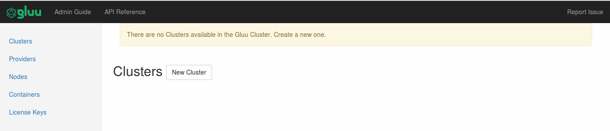

To create a new cluster, click the "New Cluster" button. A new form with various fields will appear:

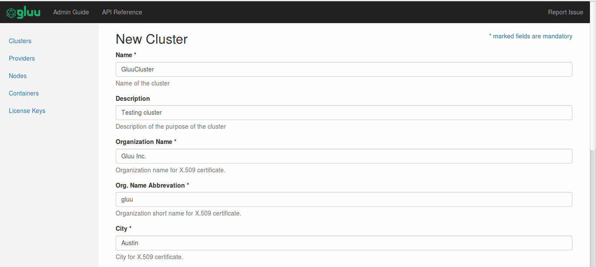

Each field is mandatory, except "Description".


In the screen above, we use `ox.example.weave.local` as an example of cluster domain.
To access the cluster, type `https://ox.example.weave.local` in browser's address bar.
In production, use our actual domain instead, e.g. `my-gluu-cluster.com`.
Note, this domain must be resolvable via DNS; otherwise the cluster will not work as expected.

Please remember, all URLs must be prefixed with `https`. That means we need to provide SSL certificate and key.
In Gluu Docker Edition, the certificate and key are called `nginx.crt` and `nginx.key` respectively, as we are using `nginx` as frontend.
So for example, if we have `my-ssl.crt` and `my-ssl.key`, we need to rename them to `nginx.crt` and `nginx.key`.
Afterwards, put them under `/var/lib/gluuengine/ssl_certs` directory (create the directory if not exist).

Now back to cluster overview.


As we have created a new cluster, a table will appear showing existing cluster information.
To see the details, click the link under "Name" header row. A new table will appear below the main table.
To delete the cluster, click the "Delete" button (the red box) under "Actions" header row.

Now we can continue creating Provider.

### Managing Provider

Provider represents a service (typically a cloud provider) that host the nodes. There are various provider type (driver) supported by Gluu Cluster Docker Edition at the moment:

1. `digitalocean` for DigitalOcean
2. `aws` for Amazon AWS EC2
3. `generic` for any generic service

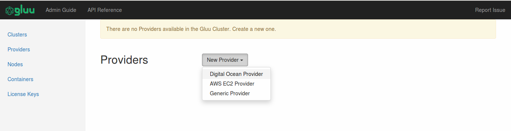

Note, we will use `digitalocean` provider throughout this page.

To create a new provider, select dropdown as seen in screenshot above. A new form will appear as seen below:

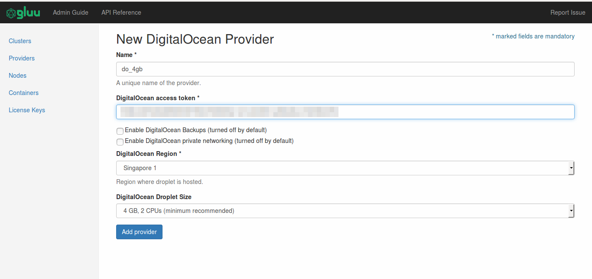

This `digitalocean` provider form has different fields with the ones that used for `aws` or `generic` provider.
Refer to [Provider](../../reference/api/provider/#create-new-provider) API for details.

Once provider has been created, we will be redirected to a page where we can see a list of providers.
To see each provider's details, we can click a link under "ID" header row.

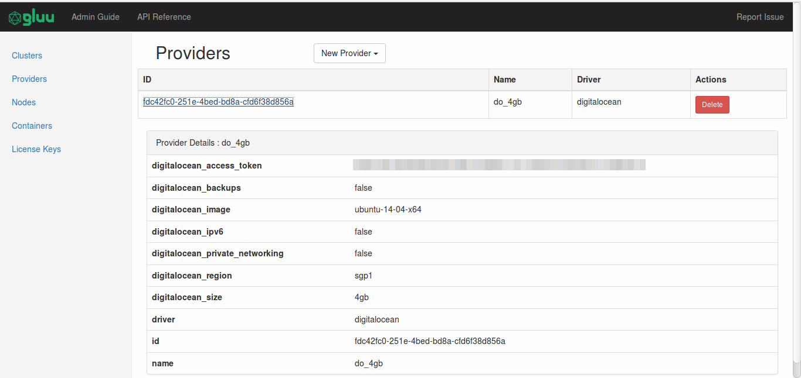

Now let's continue to Node management.

### Managing Nodes

Node represents the actual server to host containers.
There are 3 node types supported by Gluu Docker Edition at the moment:

1. Discovery
2. Master
3. Worker (optional)

A full reference to Node API is available at [Node API page](../../reference/api/node).

#### Managing Discovery Node

To create a new node, click the "New Node" button:

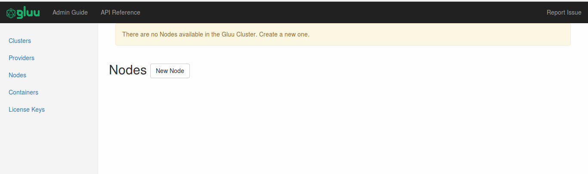

A new form will appear and we can choose to create 3 different nodes, but since we don't have any node yet, the first node we must create is the discovery node.
The role of this node is to provide node discovery (adding/removing/searching) for all nodes in the cluster.

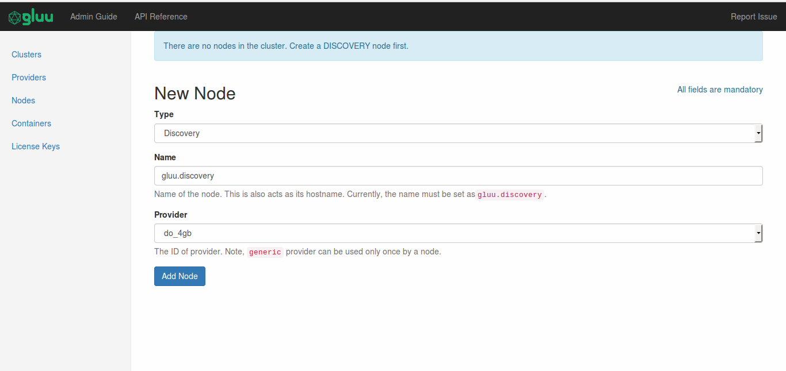

Click the "Add Node" button as seen above and we will be redirected to a new page where we can see list of available nodes and their details.

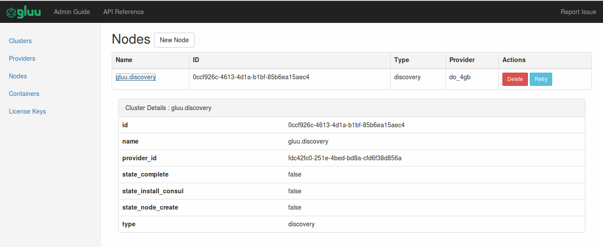

As we can see, there are various `state_*` attributes. Each of this attribute marks the progress of node deployment.
Eventually these attributes will be marked as finished (or `true` in this context) one by one.

To see the progress of node deployment, we need to run a command in the shell:

```
tailf /var/log/gluuengine/node.log
```

Below is an example of discovery node deployment log:

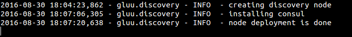

Note, we cannot deploy any Gluu container in discovery node, hence we need to create another node ... the Master node.

#### Managing Master Node

To create master node, repeat the process. When the form is shown, choose "Master" in "Type" dropdown field.

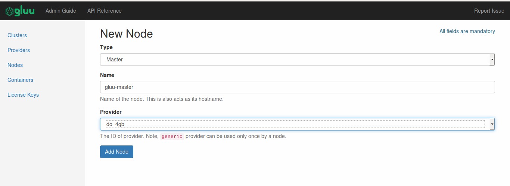

Click the "Add Node" button as seen above and we will be redirected back and see there's new master node listed there.

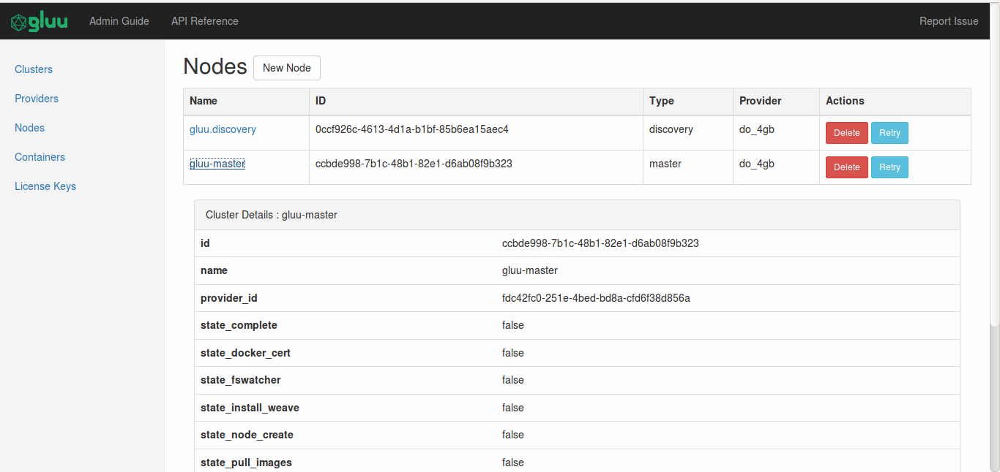

To see the progress of the new node deployment, repeat this command in the shell:

```
tailf /var/log/gluuengine/node.log
```

Below is an example of master node deployment log:

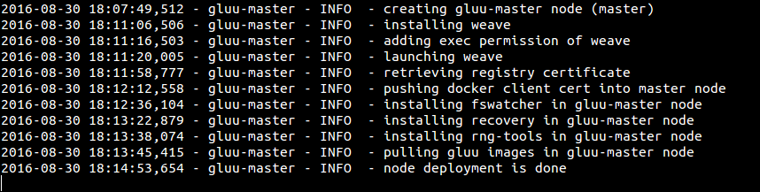

As we already have discovery and master nodes, let's start deploying Gluu container.

### Managing Containers

There are 2 ways to deploy container(s):

1. Using `New Container` button: only a single container can be selected.
2. Using `Scale Containers` button: deploy multiple `oxauth` containers. We will cover this feature later.

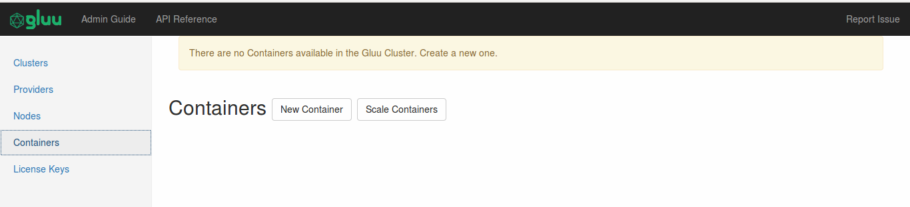

To ensure the cluster running as expected, the deployment should follow the following order:

1. `ldap`
2. `oxauth`
3. `oxtrust` (can be deployed only in master node)
4. `nginx`

Click the "New Container" button and a new form will appear:

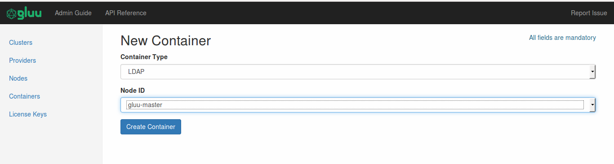

Choose "LDAP" in "Container Type" dropdown field and select existing node; in this case the "gluu-master" (master node). Remember, don't choose discovery node as it doesn't support Gluu container deployment.

Once the container has been created, it will be listed in a table as seen below:
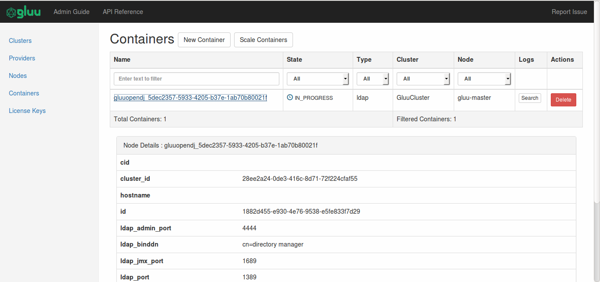

Clicking the link under "Name" header row will show us the container's details.
As we can see, the `ldap` container marked as `IN_PROGRESS`. That means the deployment is running (it may take a while to finish the whole process though). To see the progress, click the "Search" button under "Logs" header row.

When "Search" button is clicked, a new "Setup" button will replace the old button under "Logs" header row. See the screenshot below:

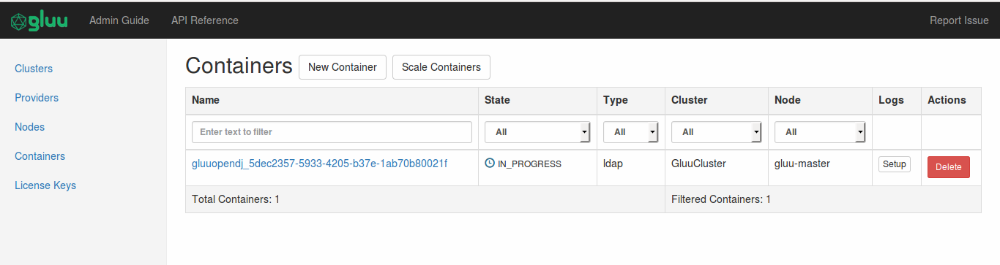

Click the "Setup" button and we will be redirected to a page where we can see the container deployment log.

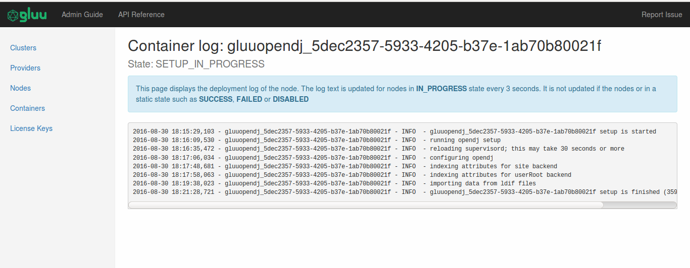

To complete cluster setup, repeat the process of deploying container for `oxauth`, `oxtrust`, and `nginx`.

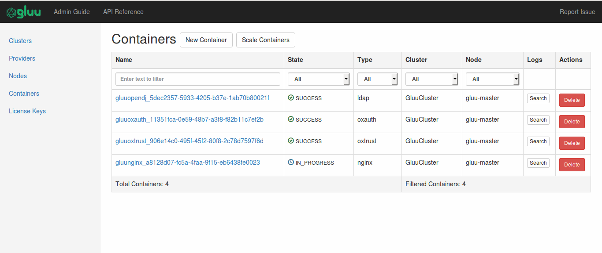

Once we have those 4 container types (all of them should be marked as SUCCESS though), we already have a basic cluster setup that should work as expected.

Let's continue to add more nodes (including license key management, scaling containers, etc.) in next sections.

### Managing License Key

Before adding any additional `worker` node, we need to add license first by clicking the "New License Key" button.

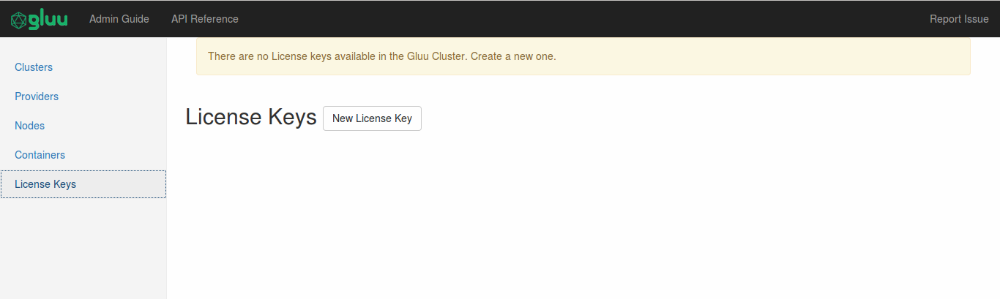

A new form will appear and we need to fill all the fields.

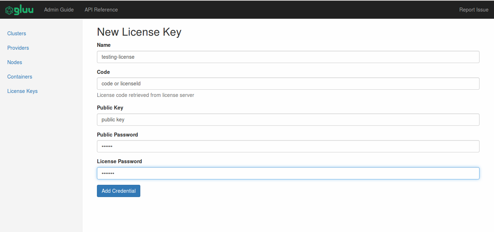

We can use any value for "Name" field, but we need to match the values for "Code" (or "licenseId"), "Public Key", "Public Password", and "License Password" fields with license we retrieved from Gluu.

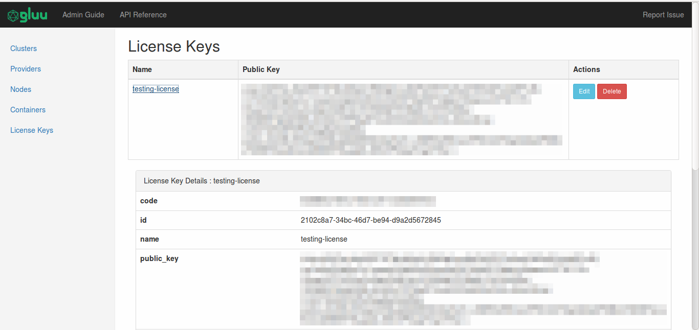

Once the license has been created, the license will be validated.
If the license is valid or not expired, we can continue to add more nodes and deploy containers in those new nodes.

### Managing Additional Worker Nodes

To create worker node, repeat the process of creating new node. When the form is shown, choose "Worker" in "Type" dropdown field.

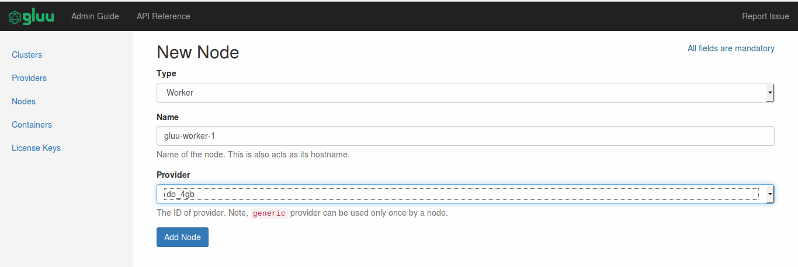

Click the "Add Node" button as seen above and we will be redirected back and see there's new worker node listed there.

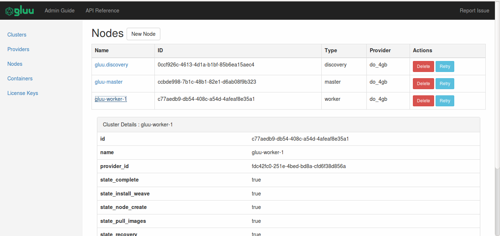

To see the progress of the new node deployment, repeat this command in the shell:

```
tailf /var/log/gluuengine/node.log
```

Below is an example of worker node deployment log:

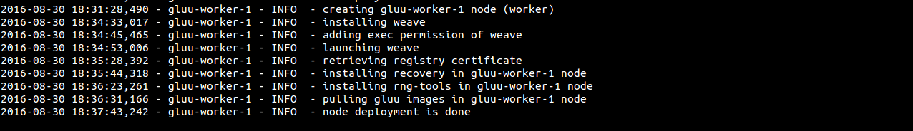

We can add more worker nodes, but in this example we will not add them anymore. Instead let's deploy containers to worker node.

### Managing Containers in Worker Node

To deploy container in worker node, repeat the same process as we did in master node, but remember to choose the worker node in "Node ID" dropdown.

Below is an example of how to deploy `nginx` container in worker node:

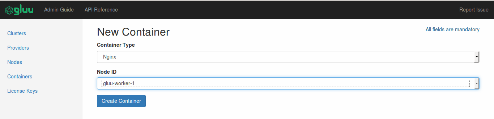

Note: In worker node, we are only allowed to deploy `ldap`, `oxauth`, and `nginx` container.

### Scaling oxAuth Container

To scale `oxauth` container (deploying multiple instances at once), we can use the scaling feature introduced in `gluuengine` version 0.5.0.

Let's get back to page where containers are listed. Click the "Containers" left pane menu and the buttons will be available as shown below:

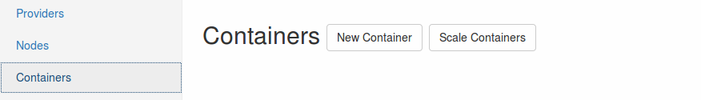

Click the "Scale Containers" button and new form will appear:

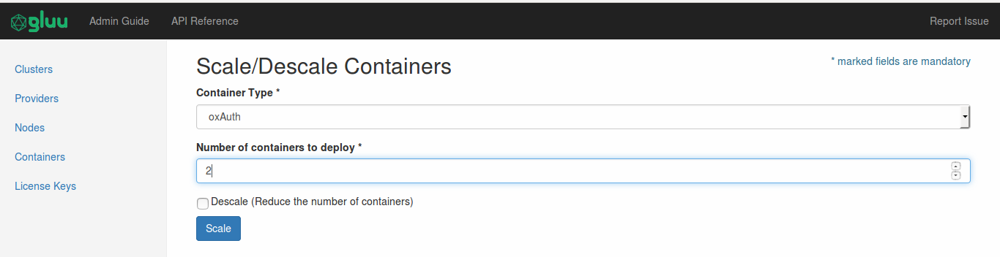

In the screenshot above, we're telling the app to deploy __2 instances__ of __oxAuth__ container into the cluster.
Afterwards click the "Scale" button and we will be redirected to list of containers page:

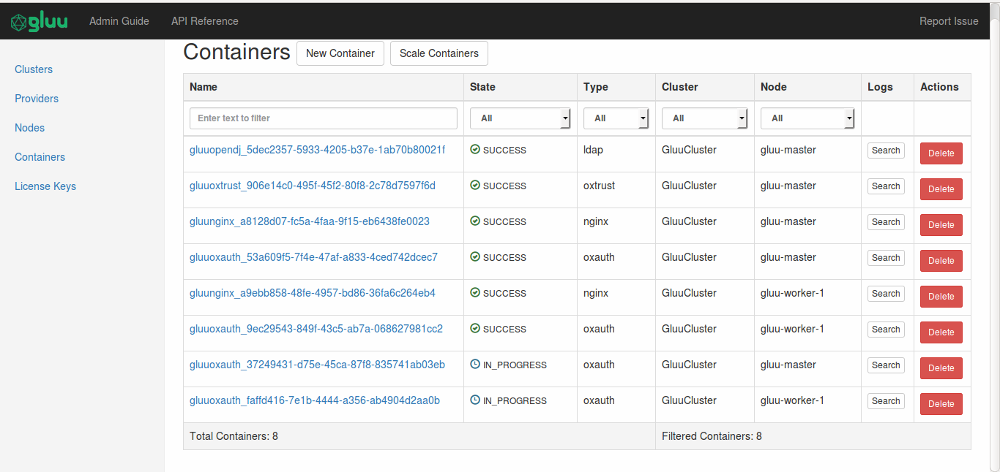

As we can see, there are 2 new oxAuth containers deployed in master and worker node (see the bottom 2 of the table above).

In addition, there's a counterpart of scaling feature called descaling:

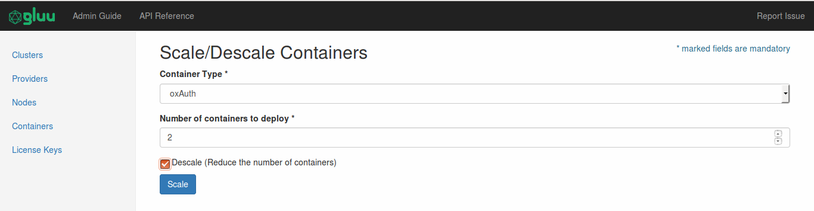

The form is identical to scaling one, but we need to check the tickbox above the "Scale" button. What this descaling feature do is removing __n instances__ of oxAuth container from the cluster.

With these scale/descale features, we can add or remove oxAuth containers easier than before.

### Reviewing Cluster Setup

As we have multi-nodes with various containers deployed into the cluster, let's take a review of our cluster.
To see an overview of what our cluster looks like, click the Gluu's logo (top left corner) in the app.

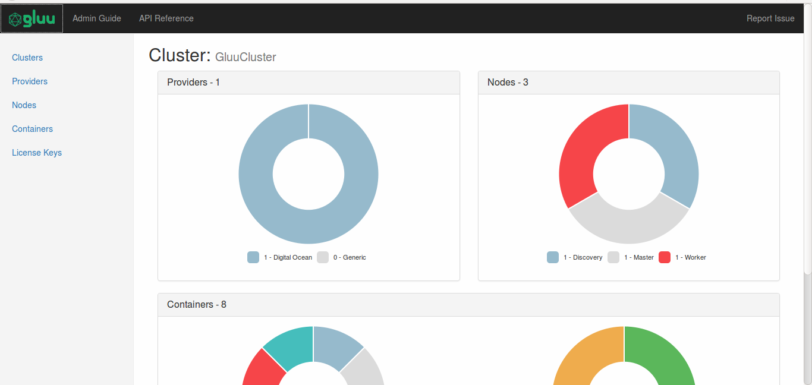

We can see how many nodes deployed in the cluster.

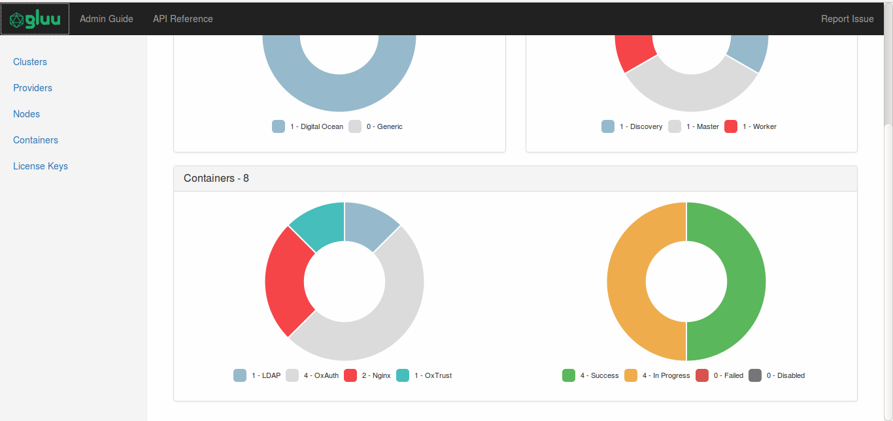

And yes, we can see how many containers deployed in the cluster.

## History

All the create requests made by the Web UI is saved in the file called  `config-history.log`. Each post request generate 3 lines of log:

1. The date and time of logging
2. The cUrl command equivalent of the POST request made from the web interface
3. The status code of the response provided by the API server

The log can be accessed from the browser at `http://localhost:8800/static/config-history.log`
